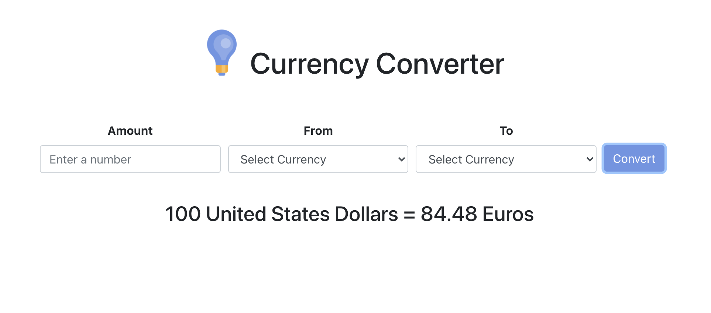

# Currency Converter App

Currency Converter is a simple currency conversion app created with React and Bootstrap. Users can enter an amount, a currency to convert from, and a currency to convert to, and the app will return the conversion.

This app uses [ExchangeRate-API](https://www.exchangerate-api.com/) to retrieve exchange rates and Netlify serverless functions to hide the API key.

You can view the Currency Converter App [here](https://nowcodethis-currency-converter-app.netlify.app/).

Learn more about me and my work on my website, [https://www.nowcodethis.com](https://www.nowcodethis.com).
